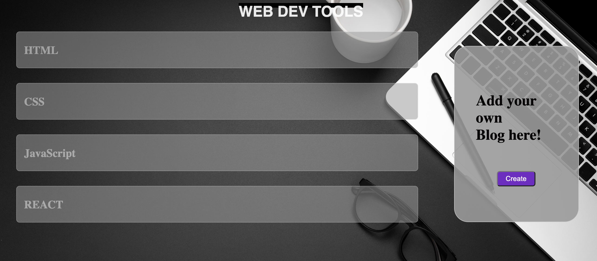
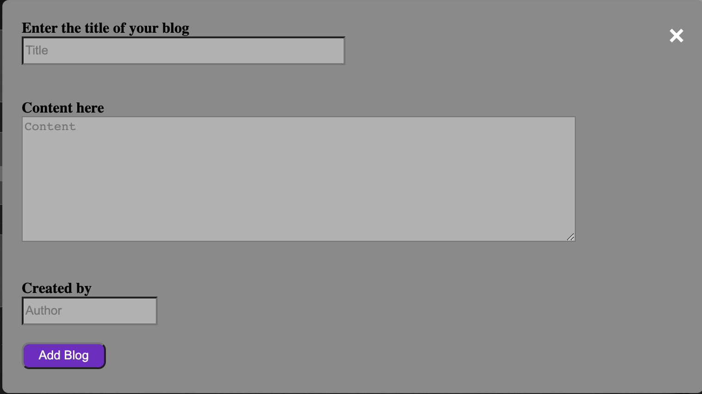
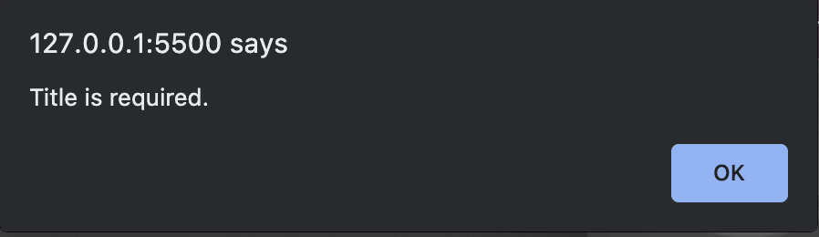
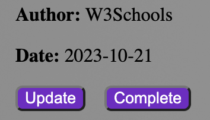
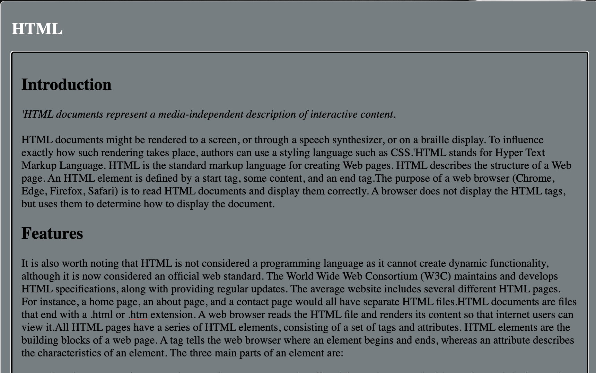

# MicroBlogging site using JavaScript
## Features Used

- HTML
- SCSS
- JavaScript

> SCSS : Variables, Mixins, Inheritance concepts are used
> JavaScript : Event listeners, JSON file read are used

## HTML

- Header section is defined with title and logo of the site
- Body section has a title bar fixed at top
- Next section is divided into two, one to fetch & display the blogs and another to add new blog
- Blogs loaded in JSON file is displayed in box 
- Blogs are used transition effect to display content on clicked
- To the added blogs there are Update button to change the content and author field
- Add blog button pops up a card to enter new blog deatils and it is added to the list
```sh
head>
    <title>Create Your own blog</title>
    <link rel="icon" href="images/blog.png" type="image/x-icon">
    <link rel="stylesheet" href="dist/blog.css">
</head>
```

## SCSS

- Basic CSS styling is done to fit he margins, paddings of various elements
- Transition properties are included to make the blog interactive
- Used variables, mixins and inheritence wherever it is required
- Created node modules and dist files for SCSS which are ignored in .gitignore

For example:
```sh
#blogBox {
  margin-bottom: 2em;
  margin-right: 45px;
  position: sticky;
}
```
## JavaScript
- Intially a XMLHttpRequest is made to access the JSON file in the data folder
- GET method is used to load the JSON data
- The status and readystate is checked to ensure that the file is loaded successfully
- Ready state has different values as:
0: request not initialized
1: server connection established
2: request received
3: processing request
4: request finished and response is ready
- JSON data is parsed to readable string
- To display a for loop runs for the number of inputs given in JSON file
- It adds the data to the section tag
- OnClick event is in place for update button: it enables only the author and content fields as editable
- On clicking add blog, a card opens with input field to fill details for new blog
- Event listener is enable for click event on submit buttton
- Picks the system date and time, formats it and passes to display in the blog

## Steps to execute the Page

- Design or fetch the JSON file with appropriate structure to load on to the webpage
- The inital page loads with data from JSON file and displayes as each block in the body section



- Hover over the Title to see some CSS effects
- Click on "Create" button
- Card layout opens up



- Fill all the necessary details in the fields provided
- Checks if the Title is filled mandatory. If not it gives a error message pop up to fill it



- Click on "Add blog" to add your blog to the existing blog list
- Click on the title of each block to expand its content and click again to collapse
- At end of each blog there is a Update button 
- If need to update the blog Click on "Update"




- Author and Content sections are enabled as editable sections to modify the data
- After modification click on "Complete" button, it will make the fields non editable
- Your Micro Blog site is ready to view with the updated informations